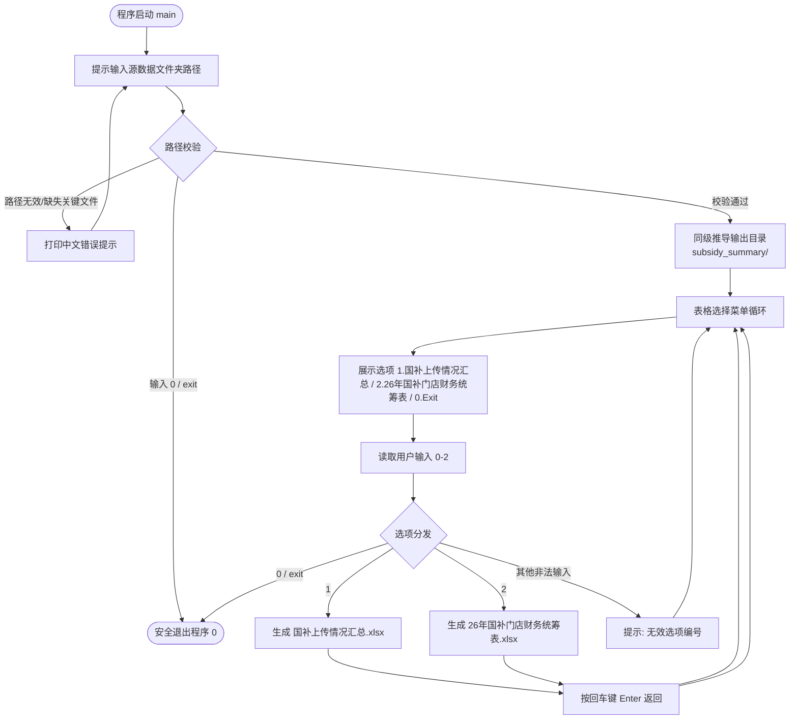
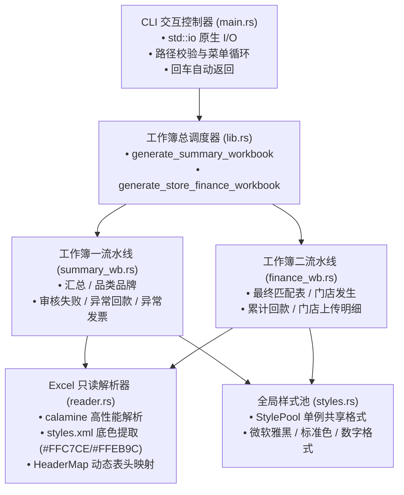

# data_status_summary 开发与业务规范文档

## 1. 项目目标与安全约束

本项目用于读取国补（消费品以旧换新补贴）业务 Excel 源数据，按业务口径与排版规范生成标准化的汇总工作簿：
1. **工作簿一**：`国补上传情况汇总.xlsx`（包含 5 个标准 Sheet）
2. **工作簿二**：`26年国补门店财务统筹表.xlsx`（包含 4 个标准 Sheet）

### 1.1 核心原则与安全边界
- **路径严禁硬编码（动态路径机制）**：
  - **源数据输入目录**：必须由用户在程序运行终端交互式输入（记为 `<输入目录>`），程序绝对不得在源码中硬编码任何绝对路径。
  - **输出目录动态推导**：输出目录（记为 `<输出目录>`）**必须位于所选 `<输入目录>` 的父目录**下的 `subsidy_summary/` 文件夹（即 `<输出目录> = <输入目录>.parent() / "subsidy_summary"`），与输入目录保持同级，不存在时由程序自动创建。
  - **临时文件原子安全发布**：生成过程统一写入 `<输出目录>/.tmp_<文件名>.xlsx`，写入完毕后原子替换，防止损坏文件或并发覆盖。
- **源数据绝对只读**：用户指定的 `<输入目录>` 及其包含的所有原始 Excel 文件均为只读数据源，严禁修改、覆盖、重命名或在其中生成临时文件。
- **交互界面零第三方依赖原则**：
  - 命令行交互严禁引入外部 CLI 依赖（如 `clap`、`dialoguer` 等），纯基于 Rust 标准库 `std::io::{stdin, stdout, Write}`。
  - 用户输入有效路径后展示 [0-2] 选择菜单（`1. 国补上传情况汇总`、`2. 26年国补门店财务统筹表`、`0. Exit`）；报表处理完成后**默认按回车键 [Enter] 返回程序选择界面**；选项 `0` 安全退出。
- **金额单位基准**：
  - `国补上传情况汇总.xlsx` 中的 `汇总` Sheet 金额统一使用**万元**（保留两位小数）。
  - 所有其他明细 Sheet 金额统一使用**元**（保留两位小数）。

---

## 2. 输入/输出目录与文件约定

```text
<父目录>/                                   # 用户源数据目录的父目录（由用户输入动态推导）
├── <输入目录>/                             # 源数据输入目录（用户在 CLI 终端输入指定，严格只读）
│   ├── 销售用券情况统计.xlsx
│   ├── 已上传家电电脑.xlsx
│   ├── 已上传数码.xlsx
│   ├── 回款明细家电电脑.xlsx
│   ├── 回款明细数码.xlsx
│   ├── 银联交易明细所有.xlsx
│   ├── 银联交易明细门店.xlsx
│   ├── 收款单统计.xlsx
│   └── 发票明细.xlsx
├── subsidy_status_summary/                # 当前汇总工具工程代码目录
└── subsidy_summary/                       # 汇总结果输出目录（与输入目录同级）
    ├── 国补上传情况汇总.xlsx                # 目标汇总文件 1（包含 5 个 Sheet）
    └── 26年国补门店财务统筹表.xlsx          # 目标汇总文件 2（包含 4 个 Sheet）
```

| 目录/文件 | 动态解析规则 | 读写权限 | 说明 |
|---|---|---|---|
| `<输入目录>` | 用户终端输入，如 `./source_data` 或绝对路径 | 严格只读 | 包含 9 份原始业务明细表 |
| `<输出目录>` | `<输入目录>.parent() / "subsidy_summary"` | 读写 | 与输入目录同级，自动创建 |
| 目标文件 1 | `<输出目录>/国补上传情况汇总.xlsx` | 原子发布 | 包含 5 个已核验确认的标准 Sheet |
| 目标文件 2 | `<输出目录>/26年国补门店财务统筹表.xlsx` | 原子发布 | 包含 4 个门店财务统筹标准 Sheet |

---

## 3. 源数据契约

源数据目录包含 9 份工作簿，均读取第一工作表（`Sheet1`），第 1 行为表头字段名，第 2 行起为真实数据行。读取时**必须按表头名称动态定位字段，严禁使用列序号硬编码**；扫描时自动**跳过名称以 `~$` 开头的 Excel 临时文件**，且不递归检索子目录。

### 3.1 9 份源文件及必要字段清单

| 序号 | 源文件名 | 必要字段 | 核心业务用途 |
|:---:|---|---|---|
| 1 | `销售用券情况统计.xlsx` | `单据号`、`单据日期`、`商品名称`、`品牌`、`财务大类`、`补贴额`、`数量`、`参考号`、`数电发票号码`、`匹配单据号`、`备注` | 核算发生额与数量；生成品类品牌汇总 |
| 2 | `已上传家电电脑.xlsx` | `商户号`、`状态`、`补贴金额`、`订单号`、`检索参考号`、`交易日期`、`发票号码`、`发票金额`、`购买方名称`、`S/N码`、`描述` 等 59 列 | 家电电脑上传/回款统计；提取审核失败；提取本店商户号；生成门店上传明细 |
| 3 | `已上传数码.xlsx` | `商户号`、`状态`、`补贴金额`、`订单号`、`检索参考号`、`交易日期`、`发票号码`、`发票金额`、`购买方名称`、`S/N码`、`IMEI1`、`IMEI2`、`描述` 等 59 列 | 数码上传/回款统计；提取数码审核失败；提取本店商户号；生成门店上传明细 |
| 4 | `回款明细家电电脑.xlsx` | `拨付批次`、`交易完成时间`、`交易参考号`、`商户订单号`、`交易订单号`、`销售企业名称`、`核销商编`、`补贴金额` 等全部 24 列 | 事业部全量下发明细；筛选本店商编提取粉色异常回款；生成门店累计回款表 |
| 5 | `回款明细数码.xlsx` | 与家电电脑回款明细完全相同的 24 列结构 | 事业部全量下发明细；筛选本店商编提取粉色异常回款；生成门店累计回款表 |
| 6 | `发票明细.xlsx` | `开票时间`、`开票类型`、`数电发票号码`、`购方名称`、`主要商品名称`、`备注信息`、`开票状态`、`匹配单据号` | 审核失败匹配商品名称；提取黄色异常发票；统筹表发票红冲校验 |
| 7 | `银联交易明细所有.xlsx` | `银商订单号`、`银商原订单号`、`交易参考号`、`商品类别`、`品牌`、`商品型号` 等 33 列 | 最终匹配表跨表双键匹配大类、品牌与产品型号 |
| 8 | `银联交易明细门店.xlsx` | `检索号`、`商户订单号`、`银商订单号`、`交易金额`、`交易时间`、`终端号`、`备注` 等 26 列 | 生成门店国补发生表；提供最终匹配表底表基础数据与退货标记 |
| 9 | `收款单统计.xlsx` | `日期`、`单据号`、`商品名称`、`原票号`、`匹配单据号`、`备注` | 预留核验对账（当前汇总阶段暂不参与输出，非阻断性必要文件） |

### 3.2 公共字段匹配规则
1. **大类归类口径**：
   - `财务大类 == '数码'` 归为数码；
   - 其余所有财务大类统一归为家电电脑。
2. **状态分类口径**：
   - `已回款`、`审核通过未回款`、`待审核`、`审核失败`、`未上传`。
3. **退货单据排他规则**：
   - `销售用券情况统计.xlsx` 中的 `退货-原单` 与 `退货-退单` 记录，在品类品牌维度聚合时必须严格排除。
4. **门店发生表退货标记**：
   - `银联交易明细门店.xlsx` 的 `备注` 字段取值为 `已退货` 时，最终匹配表将该单据状态直接锁定为 `已退货`。

### 3.3 全局字段类型与格式规范

各 Sheet 字段定义遵循以下统一格式代码与对齐规则，业务表头列无需重复展开格式细节：

| 逻辑类型 | Excel 存储类型 | 格式化代码 (Number Format) | 水平对齐 | 说明 |
|---|---|---|:---:|---|
| **ID / 编码 / 单号 / 文本** | Text | `常规` | 居左 | 强制以纯文本写入，防止科学计数法与前导零丢失 |
| **机构代码 / 状态 / 类型** | Text | `常规` | 居中 | 状态、终端号、地区编码等短标识 |
| **金额（元）** | Number | `#,##0.00;[Red]-#,##0.00` | 居右 | 单位元，保留两位小数，负数红字 |
| **金额（万元）** | Number | `#,##0.00;[Red]-#,##0.00` | 居右 | 单位万元，保留两位小数，负数红字 |
| **数量 / 笔数 / 序号** | Number | `#,##0` | 居右 / 居中 | 正负整数，千分位分隔 |
| **比率 / 占比** | Number | `0.00%` | 居右 | 百分比，保留两位小数 |
| **日期** | Date | `yyyy-mm-dd` | 居中 | 原生 Excel 日期 |
| **日期时间** | DateTime | `yyyy-mm-dd hh:mm:ss` | 居中 | 原生 Excel 日期时间 |

### 3.4 规则 REF-MERCHANT-01：本店商户号解析
- **背景**：事业部下发的两份回款明细源表（家电电脑、数码）包含全省/全区全量商户流水，必须筛选本店数据。
- **解析算法**：
  1. 家电电脑本店商户号：动态提取自 `已上传家电电脑.xlsx` 的 `商户号` 字段（取第 2 行唯一非空商户号，杜绝硬编码）；
  2. 数码本店商户号：动态提取自 `已上传数码.xlsx` 的 `商户号` 字段（取第 2 行唯一非空商户号，杜绝硬编码）；
  3. 筛选条件：凡涉及门店回款流水筛选，统一执行 `核销商编 == 本店对应品类商户号`。

### 3.5 异常颜色识别规则
- **粉色异常填充**：十六进制色彩 `FFFFC7CE` / `#FFC7CE`（回款明细异常标记）。
- **黄色异常填充**：十六进制色彩 `FFFFEB9C` / `#FFEB9C`（发票明细异常标记）。
- **解析方式**：通过流式解压读取底层 `xl/styles.xml` 与 `xl/worksheets/sheet1.xml`，通过 XF 映射精确匹配单元格背景填充色。

---

## 4. 汇总工作簿一业务规则（国补上传情况汇总.xlsx）

工作簿统一命名为 `国补上传情况汇总.xlsx`，严格包含 5 个标准 Sheet：

| Sheet 序号 | Sheet 名称 | 数据来源 | 金额单位 | 核心业务目标 |
|:---:|---|---|:---:|---|
| 1 | `汇总` | 销售用券情况统计、两份已上传明细 | 万元 | 纵向排列“金额与数量汇总表”与“结构与比率分析表” |
| 2 | `品类品牌汇总` | 销售用券情况统计 | 元 | 排除退货，动态聚合所有大类与品牌在 5 种状态下的金额与件数 |
| 3 | `审核失败明细` | 两份已上传明细、发票明细 | 元 | 纵向分区块输出家电电脑与数码审核失败记录，关联发票商品名 |
| 4 | `异常回款明细` | 两份回款明细 | 元 | 按 `REF-MERCHANT-01` 筛选本店且底色为粉色的异常流水 |
| 5 | `异常发票明细` | 发票明细 | - | 提取黄色填充发票记录，按匹配单据号升序输出 |

---

### 4.1 `汇总` Sheet 规格

#### 4.1.1 动态计算公式
1. **发生额与笔数**：取自 `销售用券情况统计.xlsx`，按大类归类口径划分。金额汇总 `补贴额`；笔数汇总 `数量`（净额）。
2. **已回款及上传状态明细**：取自两份已上传明细，按 `状态` 分类：`已回款`、`审核通过未回款`、`待审核`、`审核失败`。金额汇总 `补贴金额`；笔数统计明细记录行数。
3. **关联差额指标**：
   - `未回款金额 = 国补发生额 - 国补回款额`；`未回款笔数 = 国补发生笔数 - 国补回款笔数`
   - `未上传金额 = 未回款金额 - 审核通过未回款金额 - 待审核金额 - 审核失败金额`
   - `未上传笔数 = 未回款笔数 - 审核通过未回款笔数 - 待审核笔数 - 审核失败笔数`
4. **比率分析指标**：
   - `发生额占比 = 对应大类发生额 / 总发生额`
   - `回款率 = 对应大类回款额 / 对应大类发生额`
   - `综合回款率 = (对应大类回款额 + 对应大类审核通过未回款额) / 对应大类发生额`
   - `未回款占比 = 对应大类未回款额 / 对应大类发生额`
   - `分类未回款占比 = 分类未回款金额 / 对应大类未回款总额`

#### 4.1.2 布局结构
- 列宽：A 列 `38.0`；B 至 G 列统一为 `20.0`。
- Row 1: 主标题 `国补上传情况汇总`（A1:G1 合并居中，深蓝底白字，ht=30）
- Row 2: 副标题说明（A2:G2 合并，ht=22）
- Row 3: 空白分隔行（ht=8）
- Row 4: 表一区块标题 `一、金额与数量汇总`（A4:G4 合并居中，深蓝底白字，ht=24）
- Row 5-6: 双层分组列头（`项目`、`家电电脑`、`数码`、`合计`；子列 `金额（万元）`、`笔数`，ht=30）
- Row 7-9: 数据行（`国补发生额`、`国补回款额`、`未回款`，ht=22）
- Row 10: 提示分隔行 `未回款具体情况`（A10:G10 合并居中，淡蓝底黑字，ht=22）
- Row 11-14: 数据行（`审核通过未回款`、`待审核`、`审核失败`、`未上传`，ht=22）
- Row 15: 空白分隔行（ht=8）
- Row 16: 表二区块标题 `二、结构与比率分析`（A16:G16 合并居中，深蓝底白字，ht=24）
- Row 17-18: 双层分组列头（`指标`、`家电电脑`、`数码`、`合计`；子列 `金额（万元）`、`占比/比率`，ht=30）
- Row 19-22: 数据行（`国补发生额及占比`、`国补回款额及回款率`、`回款+审核通过未回款及综合回款率`、`未回款额`，ht=24）
- Row 23: 提示分隔行 `未回款具体情况`（A23:G23 合并居中，淡蓝底黑字，ht=22）
- Row 24-27: 数据行（`审核通过未回款`、`待审核`、`审核失败`、`未上传`，ht=22）
- Row 28: 空白分隔行（ht=8）
- Row 29: 区块标题 `口径说明`（A29:G29 合并居中，深蓝底白字，ht=24）
- Row 30-34: 5 行标准口径说明文案（A列至G列合并，ht=28）

---

### 4.2 `品类品牌汇总` Sheet 规格

#### 4.2.1 动态聚合规则
- **数据源**：`销售用券情况统计.xlsx`，排除 `备注` 为 `退货-原单` 与 `退货-退单` 的记录。
- **维度交叉**：按照源数据中实际出现的 `财务大类 + 品牌` 进行二维动态透视，不设固定品牌数量限制；对于基准品类与品牌保持标准业务序列，后续新增品类与品牌自动在末尾动态追加输出。
- **展开列**：横向展开 5 种状态：`已回款`、`审核通过未回款`、`待审核`、`审核失败`、`未上传`，每种状态各含 `补贴金额（元）` 与 `数量` 2 列。
- **大类合并**：A 列相同财务大类的连续数据行必须在输出时**动态合并单元格**并垂直居中。
- **数值留白**：金额为 0 且数量为 0 的交叉单元格统一显示短横线 `-`。

#### 4.2.2 12 列输出结构与表头布局
- 列宽：A 列 `16.0`，B 列 `16.0`，C 至 L 列（5 种状态展开列）统一为 `18.0`。
- Row 1: 主标题 `品类品牌汇总`（A1:L1 合并居中，深蓝底白字，ht=30）
- Row 2: 副标题说明（A2:L2 合并，ht=22）
- Row 3: 空白分隔行（ht=8）
- Row 4-5: 双层表头（柔和中蓝 `#5B9BD5` 填充，加粗白字居中，ht=30）：
  - A4:A5 合并居中 `财务大类`；B4:B5 合并居中 `品牌`；
  - C4:D4 合并居中 `已回款`（C5: `补贴金额（元）`，D5: `数量`）；
  - E4:F4 合并居中 `审核通过未回款`（E5: `补贴金额（元）`，F5: `数量`）；
  - G4:H4 合并居中 `待审核`（G5: `补贴金额（元）`，H5: `数量`）；
  - I4:J4 合并居中 `审核失败`（I5: `补贴金额（元）`，J5: `数量`）；
  - K4:L4 合并居中 `未上传`（K5: `补贴金额（元）`，L5: `数量`）。
- Row 6 起：各品类品牌交叉数据行（相同大类连续行动态合并 A 列）。

---

### 4.3 `审核失败明细` Sheet 规格

#### 4.3.1 相对排版布局算法
1. **数据提取**：分别从两份已上传表中提取 `状态 == '审核失败'` 的记录；家电电脑记录以其 `发票号码` 关联 `发票明细.xlsx` 的 `数电发票号码` 补齐 `主要商品名称`。
2. **相对行号生成**：
   - Row 1: 主标题 `审核失败明细`（A1:J1 合并居中，ht=30）
   - Row 2: 副标题说明（A2:J2 合并，ht=22）
   - Row 3: 空白分隔行（ht=8）
   - Row 4: 上表标题 `家电电脑审核失败明细`（A4:I4 合并居中，ht=24）
   - Row 5: 家电电脑列头（9 列，ht=30）
   - Row 6 至 $R_1$：家电电脑失败数据区（$R_1 = 5 + N_{\text{家电失败}}$）
   - Row $R_1+1$：空白分隔行（ht=8）
   - Row $R_1+2$：下表标题 `数码审核失败明细`（A:J 合并居中，ht=24）
   - Row $R_1+3$：数码列头（10 列，ht=30）
   - Row $R_1+4$ 至 $R_2$：数码失败数据区（$R_2 = R_1 + 3 + N_{\text{数码失败}}$）

#### 4.3.2 列定义
- **家电电脑（9 列）**：`交易日期` (Date)、`检索参考号` (Text)、`状态` (Text)、`描述` (Text)、`发票号码` (Text)、`发票金额` (元)、`购买方名称` (Text)、`S/N码` (Text)、`商品名称` (Text)。
- **数码（10 列）**：前 8 列同上，后接 `IMEI1` (Text)、`IMEI2` (Text)。

---

### 4.4 `异常回款明细` Sheet 规格

#### 4.4.1 提取准则与相对排版
1. **提取准则（双重过滤）**：
   - 必须同时满足：① 按 `REF-MERCHANT-01` 判定 `核销商编 == 本店商户号`；② 单元格背景颜色代码为粉色（`#FFC7CE`）。
2. **相对行号生成**：
   - Row 1: 主标题 `异常回款明细`（A1:X1 合并居中，ht=30）
   - Row 2: 副标题说明（A2:X2 合并，ht=22）
   - Row 3: 空白分隔行（ht=8）
   - Row 4: 上表标题 `家电电脑异常回款明细`（A4:X4 合并居中，ht=24）
   - Row 5: 24 列原表头（ht=34）
   - Row 6 至 $R_1$：家电电脑异常数据（$R_1 = 5 + N_{\text{家电异常}}$）
   - Row $R_1+1$：空白分隔行（ht=8）
   - Row $R_1+2$：下表标题 `数码异常回款明细`（A:X 合并居中，ht=24）
   - Row $R_1+3$：24 列原表头（ht=34）
   - Row $R_1+4$ 至 $R_2$：数码异常数据（$R_2 = R_1 + 3 + N_{\text{数码异常}}$）
3. **输出列**：完整保留源表全部 24 列原序输出。

---

### 4.5 `异常发票明细` Sheet 规格

#### 4.5.1 提取与排序准则
1. **提取准则**：从 `发票明细.xlsx` 中精确提取单元格背景为黄色填充（`#FFEB9C`）的数据行，排他排除粉色填充行。
2. **排序准则**：提取结果必须按 `匹配单据号` 字段升序排列（Ascending），空值排在最后。
3. **排版结构**：
   - Row 1: 主标题 `异常发票明细`（A1:H1 合并居中，ht=30）
   - Row 2: 副标题说明（A2:H2 合并，ht=22）
   - Row 3: 空白分隔行（ht=8）
   - Row 4: 区块标题 `黄色异常发票明细`（A4:H4 合并居中，ht=24）
   - Row 5: 列头行（8 列，ht=30）
   - Row 6 起：黄色异常发票数据行（ht=22）
4. **输出列（8 列）**：`开票时间` (DateTime)、`开票类型` (Text)、`数电发票号码` (Text)、`购方名称` (Text)、`主要商品名称` (Text)、`备注信息` (Text)、`开票状态` (Text)、`匹配单据号` (Text)。

---

## 5. 工作簿二业务规则（26年国补门店财务统筹表.xlsx）

工作簿统一命名为 `26年国补门店财务统筹表.xlsx`，严格包含 4 个标准工作表，顺序如下：

```text
最终匹配表（全部的国补发生数据上匹配）
  -> 1.门店国补发生表（银联系统直接导出，不需要加工）
  -> 2.门店累计回款表（事业部财务下发，门店筛选自己的）
  -> 3.门店上传明细（从门店银联后台每月导出后汇总）
```

---

### 5.1 Sheet 1: 最终匹配表（全部的国补发生数据上匹配）规格

#### 5.1.1 匹配算法与级联逻辑
1. **底表流水基准**：数据行与 `1.门店国补发生表` 完全一致。每行自增生成正整数 `序号`（1, 2, 3, ...）。
2. **大类/品牌/型号双键级联检索**：
   - 数据源：`银联交易明细所有.xlsx`。
   - **主键检索**：本表 `检索号` $\leftrightarrow$ 所有表 `交易参考号`；
   - **次键兜底**：若未命中，以本表 `银商订单号` $\leftrightarrow$ 所有表 `银商订单号` 或 `银商原订单号`；
   - 提取映射：`大类` $\leftarrow$ `商品类别`，`品牌` $\leftarrow$ `品牌`，`产品型号` $\leftarrow$ `商品型号`；未命中留空。
3. **状态列多级判定**：
   - **第一优先级（已退货）**：若门店发生表 `备注 == '已退货'`，本表状态直接填入 `已退货`；
   - **第二优先级（上传状态命中）**：非退货单据以 `检索号` 关联 `3.门店上传明细` 的 `检索参考号`，命中则提取其 `状态`（`已回款`、`审核通过未回款`、`待审核`、`审核失败`）；
   - **第三优先级（未提交兜底）**：未在上传明细中命中的单据统一填入 `未提交`。
4. **发票号单源提取**：
   - 以 `检索号` 关联 `3.门店上传明细` 的 `检索参考号`，若命中且源表发票号码非空，填入本表 `发票号`；未命中或源为空则保持留空。
5. **发票红冲状态校验**：
   - 当本表 `发票号` 非空时，以该发票号在 `发票明细.xlsx` 的 `数电发票号码` 中精确检索：
     - 若命中且 `开票类型 == '红票'` 或 `开票状态 == '已红冲'` $\to$ 填入 `是`；
     - 若命中且状态正常（`开票类型 == '蓝票'` 且 `开票状态 == '开票完成'`） $\to$ 填入 `否`；
     - 若未在底库中命中，保持留空；
   - 发票号本身为空的记录，`发票是否红冲` 统一保持留空。

#### 5.1.2 27 列输出结构（A-AA）
Row 1 为表头行（柔和中蓝 `#5B9BD5` 填充，11pt 白字加粗，ht=30），冻结首行：
1. `序号` (Number) | 2. `清算时间` (DateTime) | 3. `交易时间` (DateTime) | 4. `终端号` (Text) | 5. `交易类型` (Text) | 6. `卡号` (Text) | 7. `交易金额` (元) | 8. `清算金额` (元) | 9. `手续费` (元) | 10. `流水号` (Text) | 11. `检索号` (Text) | 12. `卡类型` (Text) | 13. `发卡行` (Text) | 14. `商户号` (Text) | 15. `商户名称` (Text) | 16. `分店简称` (Text) | 17. `商户订单号` (Text) | 18. `银商订单号` (Text) | 19. `交易方式` (Text) | 20. `分店` (Text) | 21. `优惠金额` (元) | 22. `大类` (Text) | 23. `品牌` (Text) | 24. `产品型号` (Text) | 25. `状态` (Text) | 26. `发票号` (Text) | 27. `发票是否红冲` (Text)。

---

### 5.2 Sheet 2: 1.门店国补发生表（银联系统直接导出，不需要加工）规格
- **直通输出规范**：以 `银联交易明细门店.xlsx` 为唯一数据源，100% 完整保留原始全部 26 列及其原始先后顺序，不增删改列。
- **格式规范**：时间列转为 DateTime，金额列转为货币格式，编码列强制纯文本保存。首行开启冻结。

---

### 5.3 Sheet 3: 2.门店累计回款表（事业部财务下发，门店筛选自己的）规格
- **动态筛选与追加**：
  1. 家电电脑回款：读取 `回款明细家电电脑.xlsx`，按 `REF-MERCHANT-01` 筛选提取属于本店的数据行；
  2. 数码回款：读取 `回款明细数码.xlsx`，按 `REF-MERCHANT-01` 筛选提取属于本店的数据行；
  3. 纵向追加：两表为同构 24 列结构，先输出家电电脑筛选行，再紧接着追加数码筛选行。
- **输出列（24 列）**：完整保留源表字段原序。

---

### 5.4 Sheet 4: 3.门店上传明细（从门店银联后台每月导出后汇总）规格

#### 5.4.1 跨品类异构对齐规则
1. **公共前 25 列（列 1-25 / A-Y）**：从 `实时清分UUID` 到 `是否属于 AI 产品`，两表同名同序，直接对齐。
2. **数码特有设备码（列 26-27 / Z-AA）**：插入 `IMEI1` 与 `IMEI2`；数码保留源值，家电电脑填充留空。
3. **重复列名与图片归一化（列 23、28-42）**：
   - 第 23 列 `图片1` 为前置凭证图；第 28 列 `图片1` 为多图组起始图；解析表头时必须通过出现次序双重定位；
   - `img5` / `img6`（列 32-33）：家电电脑源列为 `img5/img6`，数码源列为 `图片5/图片6`，统一归一对齐至输出列 `img5/img6`；
   - 其余图片列两表同名对齐。
4. **单据与能效字段（列 43-56）**：`EEG`（列 45）家电电脑特有，数码填充留空；其余同名字段对齐。
5. **同义词映射（列 57）**：家电电脑源列名为 `交旧品类`，数码源列名为 `oldExchangeType`，统一归一对齐至标准列 `交旧品类`。
6. **空调套机字段（列 59）**：`airConditionerKitInfo` 家电电脑特有，数码填充留空。
7. **尾部字段（列 60-61）**：`开票日期`、`补贴金额` 两表同名对齐。

#### 5.4.2 61 列输出标准定义
Row 1 为表头行（柔和中蓝 `#5B9BD5` 填充，加粗白字，ht=30），冻结首行：
1. `实时清分UUID` | 2. `商户号` | 3. `商户名称` | 4. `订单号` | 5. `交易日期` | 6. `交易金额` | 7. `检索参考号` | 8. `模版类型` | 9. `状态` | 10. `描述` | 11. `提交时间` | 12. `更新时间` | 13. `终端号` | 14. `分店id` | 15. `分店名` | 16. `所在地区` | 17. `详细地址` | 18. `地区编码` | 19. `tel` | 20. `发票号码` | 21. `发票金额` | 22. `购买方名称` | 23. `图片1`（凭证） | 24. `S/N码` | 25. `是否属于 AI 产品` | 26. `IMEI1` | 27. `IMEI2` | 28. `图片1`（组图） | 29. `图片2` | 30. `图片3` | 31. `图片4` | 32. `img5` | 33. `img6` | 34. `img7` | 35. `img8` | 36. `img9` | 37. `img10` | 38. `img11` | 39. `img12` | 40. `img13` | 41. `img14` | 42. `img15` | 43. `签收时间` | 44. `remark` | 45. `EEG` | 46. `物流单号` | 47. `erpOrderNum` | 48. `ocrModify` | 49. `modifyStatus` | 50. `introduceInvoiceFlag` | 51. `是否交旧` | 52. `是否自提` | 53. `receiverName` | 54. `productCode` | 55. `subsideAmt` | 56. `productName` | 57. `交旧品类` | 58. `收货地址是否农村地区` | 59. `airConditionerKitInfo` | 60. `开票日期` | 61. `补贴金额`。

---

## 6. 动态生成与数据变化应对规则

为保证系统在面对不同月份、不同批次数据源时的长期健壮性，程序必须严格遵循以下动态适配规则：
1. **行数动态化（禁止依赖固定行数）**：
   - 严禁在代码中写死任何固定数据行数或固定行号（如 `row <= 48`、`44 笔` 等）。
   - 数据遍历完全由迭代器与实际记录数动态驱动；各表合并单元格范围基于实际相同大类出现的起始与结束索引动态计算。
2. **品牌与大类动态化（禁止依赖固定品牌数量）**：
   - 品类品牌汇总表按照源数据实际过滤后出现的维度键动态透视，自动兼容后续可能新增的财务大类或新品牌。
3. **异常状态与空值兜底**：
   - 跨表匹配未命中字段统一输出留空（`""`），严禁输出 `#N/A`、`null` 或 panic 崩溃。
   - 解析数值或日期异常时提供安全降级，并输出友好的行列级别中文提示。
4. **唯一性校验**：
   - 动态解析商户号时，若源数据出现多个不同商户号，程序捕获并提示商户号歧义。

---

## 7. 全局 Excel 排版与终端交互规范

### 7.1 排版设计基准
- **统一字体**：全工作簿统用 `微软雅黑`（Microsoft YaHei）。
- **标准调色板**：
  - 主标题 / 区块大标题：深海军蓝 `#1F4E78`（加粗白字）
  - 列头背景：柔和中蓝 `#5B9BD5`（加粗白字）
  - 分隔提示行：极浅淡蓝 `#D9EAF7`（加粗黑字）
  - 全网格边框：浅灰细边框 `#D9D9D9`
- **标准行高**：
  - 主标题 Row 1: `30.0`；副标题 Row 2: `22.0`；区块标题行: `24.0`
  - 列头行: `30.0`（字段繁多折行时为 `34.0`）；普通数据行: `22.0`；留白空行: `8.0`

### 7.2 终端交互与运行调度



- **自动返回机制**：生成操作完成后输出耗时，提示 `按回车键返回... `，用户敲击回车后重新渲染菜单，保持已有路径上下文。
- **实际交互呈现**：
  ```text
  请输入源数据文件夹路径: 

  1. 国补上传情况汇总
  2. 26年国补门店财务统筹表
  0. Exit
  请输入选项编号 [0-2]: 1

  正在处理: 国补上传情况汇总.xlsx ...
  已完成 (耗时: 808.81ms)

  按回车键返回... 
  ```

---

## 8. 软件架构设计

### 8.1 软件分层架构拓扑



### 8.2 依赖规约（极简 6 依赖）
```toml
[dependencies]
calamine = { version = "0.36.1", features = ["dates"] }
rust_xlsxwriter = { version = "0.99.1", features = ["chrono", "rust_decimal"] }
rust_decimal = "1.43"
chrono = "0.4.45"
zip = "8.6"
quick-xml = "0.41"
```
*注：严格排除第三方 CLI/TUI 库，命令行纯基于标准库实现。*

### 8.3 模块职责与核心接口
- **`main.rs`**：命令行入口，负责用户路径交互、文件扫描、菜单分发与回车事件循环。
- **`lib.rs`**：核心库入口，导出 `generate_summary_workbook` 与 `generate_store_finance_workbook` 统一构建函数。
- **`reader.rs`**：底层 Excel 读取与 XML 解析，提供 `read_sheet_rows`、`HeaderMap` 动态表头定位、`get_colored_row_indices` 底色识别。
- **`styles.rs`**：`StylePool` 单例样式池，预建标准 Format，避免频繁分配格式对象。
- **`summary_wb.rs`**：工作簿一（5 个 Sheet）的指标计算、矩阵透视与排版写入。
- **`finance_wb.rs`**：工作簿二（4 个 Sheet）的银联双键索引、状态级联判定与 61 列跨类对齐合并。

### 8.4 源码模块树
```text
src/
├── main.rs          # CLI 终端入口与事件循环
├── lib.rs           # 核心调度函数入口
├── reader.rs        # 数据读取、XML底色提取、HeaderMap
├── styles.rs        # StylePool 全局共享样式池
├── summary_wb.rs    # 工作簿一：国补上传情况汇总生成逻辑
└── finance_wb.rs    # 工作簿二：26年国补门店财务统筹表生成逻辑
tests/
└── acceptance_test.rs # 全量回归验收测试套件
```

### 8.5 性能与内存原则
- **源文件单次解析**：同一运行周期内源文件原则上只解析一次，公共索引在内存中只构建一次并共享；
- **样式池化共享**：避免在单元格写入循环中重复创建 Format，统一通过 `StylePool` 共享；
- **按需与流式提取**：XML 样式解析与单元格行遍历优先采用流式机制，控制峰值内存；
- **具体耗时与内存**：以 release 模式 benchmark 运行指标为准。

### 8.6 编译与测试指引
```bash
# 1. 构建 Release 优化版可执行程序
cargo build --release

# 2. 运行交互式处理程序
./target/release/data_status_summary

# 3. 运行全量业务验收测试套件（9 份数据端到端回归）
cargo test --test acceptance_test --release -- --nocapture
```

---

## 9. 当前基准数据集回归测试矩阵

> **特别说明**：本章指标为 **2026 当前这批基准源数据** 在执行上述通用业务规则后的核验标准，用于自动化回归测试，不作为正文算法的硬编码限制。

### 9.1 工作簿一：国补上传情况汇总.xlsx 当前基准指标
| 校验对象 | 校验项目 | 当前基准值 | 容差要求 |
|---|---|---|:---:|
| **全工作簿** | Sheet 数量与名称 | 5 个：`汇总`、`品类品牌汇总`、`审核失败明细`、`异常回款明细`、`异常发票明细` | 严格一致 |
| **汇总 Sheet** | 国补发生额 | 家电电脑 339.95 万元 / 数码 313.20 万元 / 合计 653.16 万元 | 0 误差 |
|  | 国补回款额 | 家电电脑 217.15 万元 / 数码 211.33 万元 / 合计 428.48 万元 | 0 误差 |
|  | 未回款额 | 家电电脑 122.80 万元 / 数码 101.88 万元 / 合计 224.68 万元 | 0 误差 |
|  | 综合回款率 | 家电电脑 73.90% / 数码 93.81% / 合计 83.45% | 0 误差 |
| **品类品牌汇总** | 品牌有效数据行数 | 43 行（Row 6 至 Row 48） | 严格一致 |
|  | 排除退货合计补贴金额 | `6,523,302.57` 元 | 0 误差 |
|  | 排除退货合计数量 | `13,263` 件 | 0 误差 |
| **审核失败明细** | 失败记录笔数 | 206 笔（家电电脑 132 笔 + 数码 74 笔） | 0 误差 |
| **异常回款明细** | 本店异常回款笔数 | 46 笔（家电电脑 44 笔 + 数码 2 笔） | 0 误差 |
| **异常发票明细** | 黄色异常发票笔数 | 38 笔 | 0 误差 |

### 9.2 工作簿二：26年国补门店财务统筹表.xlsx 当前基准指标
| 校验对象 | 校验项目 | 当前基准值 | 容差要求 |
|---|---|---|:---:|
| **全工作簿** | Sheet 数量与名称 | 4 个：`最终匹配表（全部的国补发生数据上匹配）`、`1.门店国补发生表（银联系统直接导出，不需要加工）`、`2.门店累计回款表（事业部财务下发，门店筛选自己的）`、`3.门店上传明细（从门店银联后台每月导出后汇总）` | 严格一致 |
| **最终匹配表** | 总记录行数 | 严格 13,971 行（27 列） | 严格一致 |
|  | 状态为“已退货”单据数 | 严格 344 笔 | 0 误差 |
|  | 状态为“未提交”单据数 | 严格 1,617 笔 | 0 误差 |
|  | 有发票号单据数 | 严格 12,023 笔（12,006 笔非退货有票 + 17 笔退货有票；留空 1,948 笔） | 0 误差 |
|  | 发票红冲为“是”单据数 | 严格 65 笔 | 0 误差 |
|  | 发票红冲为“否”单据数 | 严格 11,957 笔 | 0 误差 |
|  | 发票红冲“留空”单据数 | 严格 1,949 笔（1,948 笔无票 + 1 笔底库未记录） | 0 误差 |
| **1.门店发生表**| 数据行数与列数 | 13,971 行数据，26 列 | 严格一致 |
| **2.累计回款表**| 数据行数与列数 | 8,840 行数据（家电电脑 3,932 + 数码 4,908），24 列 | 严格一致 |
| **3.上传明细**  | 数据行数与列数 | 12,010 行数据（家电电脑 4,825 + 数码 7,185），61 列 | 严格一致 |

---

## 10. 待确认与后续拓展事项

1. **`收款单统计.xlsx` 业务预留**：当前仅作为预留数据源，暂不参与输出；待财务明确核销对账需求后可扩展为独立对账 Sheet。
2. **状态枚举扩充适配**：后续若业务新增状态枚举值，需要在状态归类与比率分析中增补分类映射。
3. **新增财务大类排序**：后续若出现新的财务大类，需与业务确认大类的标准展示顺序。
4. **异常标记颜色变更**：若各系统后续调整异常高亮底色，需同步更新 `3.5` 节的颜色识别代码。

---

## 11. 非目标

- 不做图形用户界面（GUI），仅提供纯原生标准库驱动的 CLI 交互工具。
- 不修改源数据，源文件严格只读。
- 不支持 `.xlsx` 以外的文件格式（如 `.xls` 或 `.csv`）。
